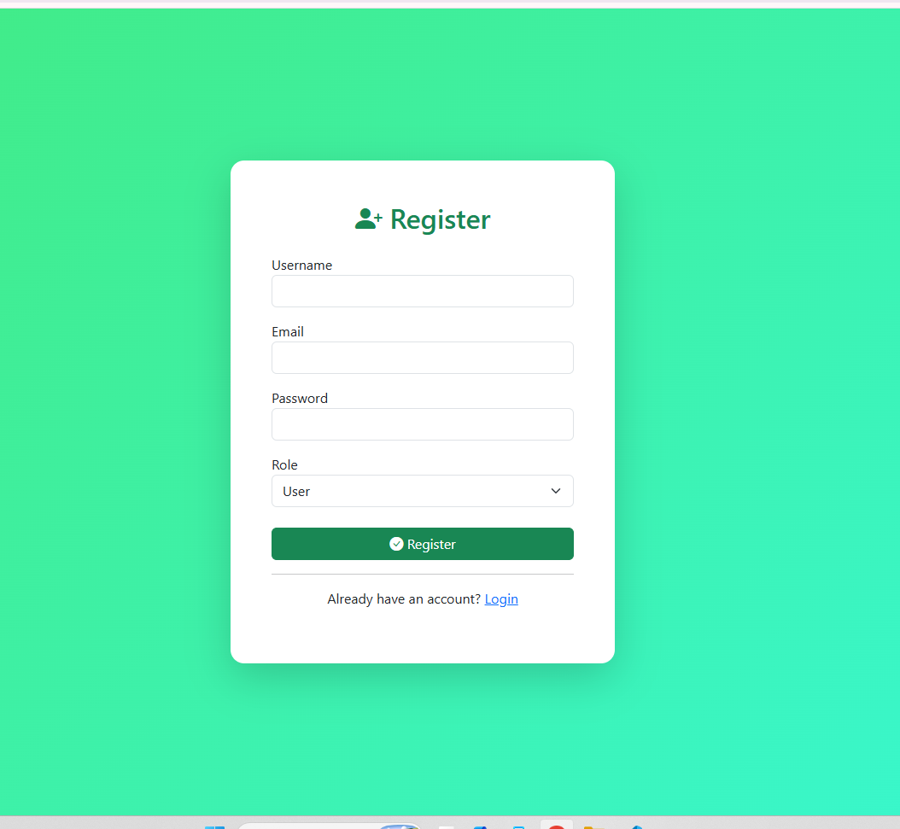
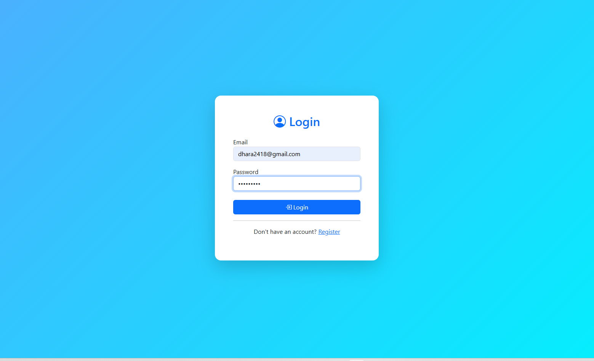
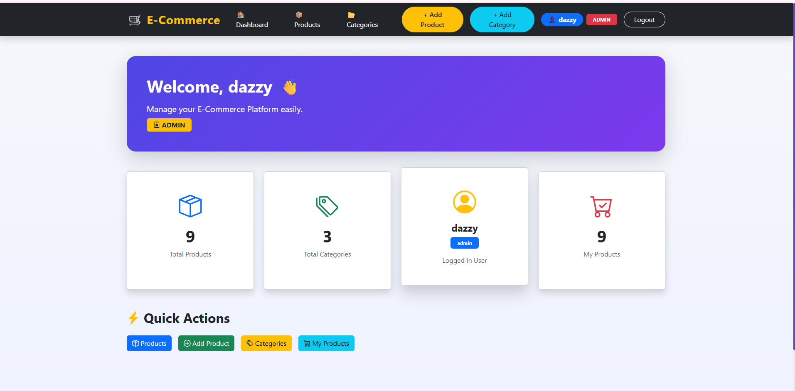
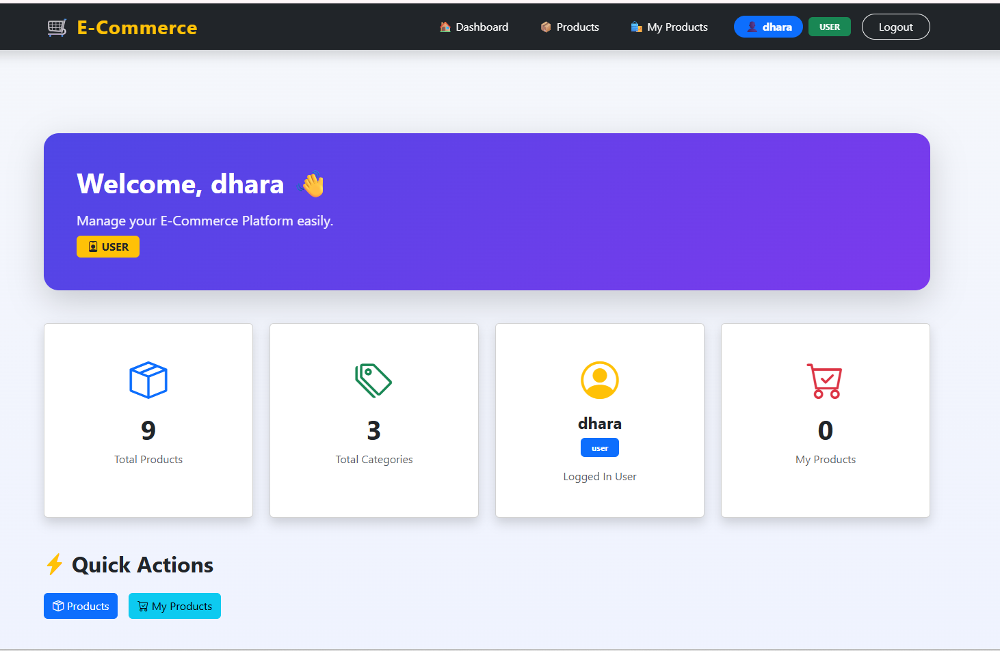
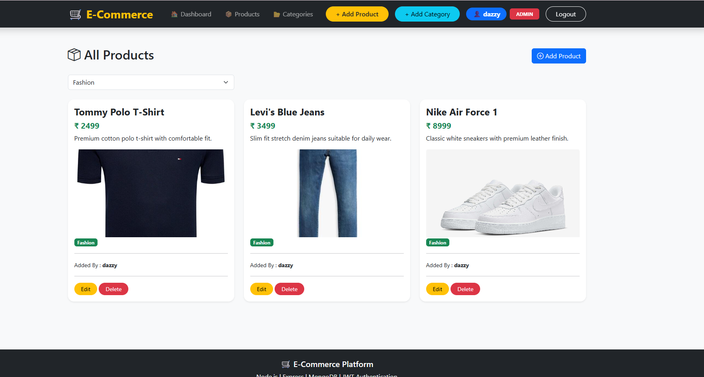
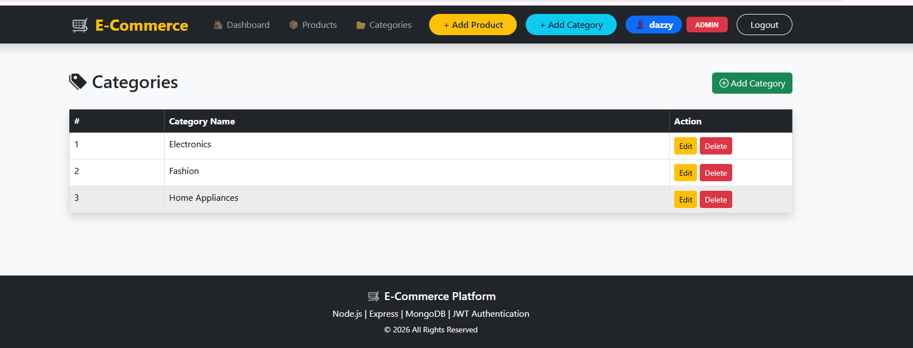

# 🛒 E-Commerce Management System


A modern **E-Commerce Management System** built using **Node.js, Express.js, MongoDB, EJS, Bootstrap 5, JWT Authentication and Multer**.

The project provides secure authentication, role-based authorization, category management, product management, image upload, premium dashboard and responsive UI.

---

# 📸 Screenshots

## register





## login





## Dashboard







## Product List




## Categories





---

# ✨ Features

## Authentication

- User Registration
- User Login
- JWT Authentication
- Password Hashing (bcrypt)
- Cookie Authentication
- Logout

---

## Dashboard

- Total Products
- Total Categories
- My Products
- Logged-in User
- Premium Dashboard Cards
- Quick Actions

---

## Product Module

- Add Product
- Edit Product
- Delete Product
- Product Image Upload
- Category Selection
- Product Filter
- My Products
- Product Owner Details

---

## Category Module

- Add Category
- Edit Category
- Delete Category
- Category Filter
- Duplicate Category Validation

---

## Security

- Protected Routes
- JWT Authentication
- Role Based Authorization
- Flash Messages
- Password Encryption

---

# 🛠 Tech Stack

## Frontend

- HTML5
- CSS3
- Bootstrap 5
- Bootstrap Icons
- EJS

## Backend

- Node.js
- Express.js
- MongoDB
- Mongoose

## Authentication

- JWT
- bcryptjs

## Other Packages

- Multer
- Cookie Parser
- Express Session
- Connect Flash
- Dotenv

---

# 📁 Folder Structure

```
EcommerceProject
│
├── config
├── controllers
├── middleware
├── models
├── public
│   ├── css
│   ├── uploads
│   └── images
├── routes
├── views
├── .env
├── app.js
├── package.json
└── README.md
```

---

# ⚙ Installation

### Clone Repository

```bash
git clone https://github.com/YOUR_USERNAME/EcommerceProject.git
```

### Move into Project

```bash
cd EcommerceProject
```

### Install Packages

```bash
npm install
```

### Create .env File

```env
PORT=9090

MONGO_URI=mongodb://127.0.0.1:27017/ecommerce

JWT_SECRET=your_secret_key
```

### Start Server

```bash
npm run dev
```

or

```bash
npm start
```

Open Browser

```
http://localhost:9090
```

---

# 📌 Routes

## Authentication

| Method | Route |
|---------|-------|
| GET | /register |
| POST | /register |
| GET | /login |
| POST | /login |
| GET | /logout |

---

## Products

| Method | Route |
|---------|-------|
| GET | /products |
| GET | /my-products |
| GET | /product/add |
| POST | /product/add |
| GET | /product/edit/:id |
| POST | /product/update/:id |
| GET | /product/delete/:id |

---

## Categories

| Method | Route |
|---------|-------|
| GET | /categories |
| GET | /category/add |
| POST | /category/add |
| GET | /category/edit/:id |
| POST | /category/update/:id |
| GET | /category/delete/:id |

---

# 🚀 Future Improvements

- Shopping Cart
- Wishlist
- Product Search
- Pagination
- Orders
- Payment Gateway
- Email Verification
- User Profile

---

# 👨‍💻 Developer

**Dhara Parekh**

B.Sc. IT Student

Node.js • Express.js • MongoDB • EJS • Bootstrap

---

# ⭐ Project Status

✅ JWT Authentication

✅ Role Based Access

✅ Product CRUD

✅ Category CRUD

✅ Dashboard

✅ Multer Upload

✅ Responsive UI

✅ Premium Design

✅ Exam Ready

---

# 📄 License

This project is developed for educational and learning purposes.
